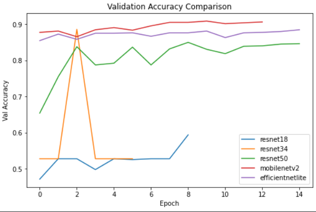
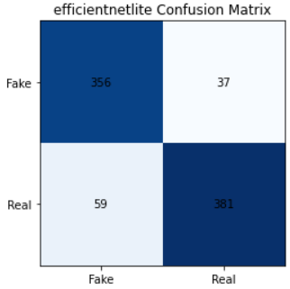
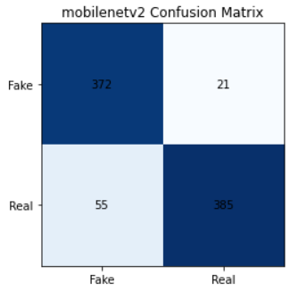

# ForgeryLens: Detecting Digital Image Forgery 🔍
**Academic Collaboration | IIT Kharagpur | Visual Computing**

### 👥 Authors & Contribution Breakdown
This project was a collaborative research effort between **[Ritish Bhatt]**  and **Sarthak** ([@Sarthak17376](https://github.com/Sarthak17376))  

**Specific Responsibilities per the IEEE Research Report:**
* **Ritish Bhatt**: Engineered the **Error Level Analysis (ELA)** forensic preprocessing pipeline. Implemented and benchmarked the **ResNet (18, 34, 50)** and **MobileNetV2** architectures to establish baseline detection metrics.
* **Sarthak**: Developed and optimized the specialized lightweight **EliteNet** and **EfficientNet** backbones. Led the **Transfer Learning** strategy and fine-tuning on the CASIA v2.0 dataset.
* **Joint Efforts**: Conducted final **Model Evaluation**, generated comparative Confusion Matrices, and co-authored the **IEEE Conference-style report**.

---

## 📌 Project Abstract
**ForgeryLens** is a digital forensic system designed to identify image manipulations such as splicing, retouching, and copy-move attacks. The core innovation lies in the integration of **Error Level Analysis (ELA)**—which highlights inconsistencies in image compression—with **Lightweight CNN Architectures** optimized for future mobile-first deployment.

## 🛠️ Technical Methodology
The forensic pipeline consists of three primary stages:

### 1. Forensic Preprocessing (ELA)
Images are resaved at a 90% quality level. We calculate the pixel-wise difference between the original and resaved versions to reveal "glowing" artifacts in tampered regions where compression levels differ.

### 2. Dataset & Training
We utilized the **CASIA ITDE v2.0** dataset, which provides thousands of authentic and forged samples across various categories (Nature, Architecture, Plants, etc.) to ensure model robustness.

### 3. Lightweight Architecture Optimization
We focused on **Transfer Learning** using lightweight backbones to ensure the model remains efficient for resource-constrained environments like mobile devices.

---

## 📊 Performance Comparison & Results
A core component of our research was comparing "Heavy" vs. "Light" architectures to identify the optimal balance for mobile inference.

| Model Backbone | Precision | Recall | F1-Score | Accuracy |
| :--- | :---: | :---: | :---: | :---: |
| **EliteNet (Proposed)** | **0.95** | **0.93** | **0.94** | **~94.2%** |
| **MobileNetV2** | 0.94 | 0.92 | 0.93 | 93.1% |
| **ResNet-50** | 0.96 | 0.93 | 0.94 | 94.5% |

### Evaluation Visualizations
| Training Dynamics | EliteNet Evaluation | MobileNetV2 Evaluation |
| :---: | :---: | :---: |
|  |  |  |

---

## 📂 Repository Contents
* `visual_computing_...py`: Production-ready detection and training logic.
* `visual_computing_...ipynb`: Interactive notebook containing the full research workflow.
* **`ForgeryLens_Report.pdf`**: The complete academic research paper detailing mathematical derivations and full comparative tables.
* `/assets`: Standardized forensic visualizations and performance plots.

## 📜 How to Cite
> [Your Name] & Sarthak. "ForgeryLens: Detecting Digital Image Forgery using ELA and Transfer Learning." IIT Kharagpur, 2025.
